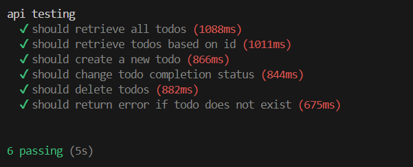

# api-testing-with-mocha-and-chai
An API testing using Mocha framework and Chai as assertion with Page Object Model design pattern.

For this simple project I use https://calm-plum-jaguar-tutu.cyclic.app/todos

Check the repository [here](https://github.com/ndraaditiya/public-api-crud-todoApp)

Test result:

How to run the repository:

1. git clone https://github.com/vaniamirandaa/api-testing-with-mocha-and-chai
2. run npm i
3. run npm test
